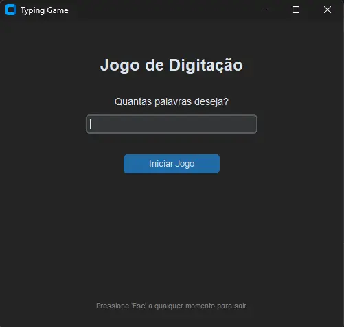

# ⌨️ Speed Typing Game - Refactoring Project

Um jogo de digitação desenvolvido em Python para calcular a velocidade (WPM - Words Per Minute) e a precisão do usuário ao digitar palavras. 

Este repositório documenta a evolução do projeto, apresentando desde a versão inicial em linha de comando (CLI) até a versão moderna refatorada com Interface Gráfica (GUI) orientada a eventos.

## 🚀 O Projeto: Antes e Depois

### 1. Versão Legacy (Terminal)
A primeira versão (`TypingGame_cli.py`) foi construída com um paradigma procedural estruturado. O jogo consome uma API externa para gerar a wordlist e calcula o tempo de resposta do usuário via `input()` no terminal, aguardando a interação síncrona.

### 2. Versão Moderna (GUI)
A segunda versão (`TypingGame_gui.py`) representa uma refatoração arquitetural completa. Saindo de loops síncronos para uma **arquitetura orientada a eventos**, utilizando a biblioteca `CustomTkinter`.

**Melhorias Implementadas:**
* **Programação Orientada a Objetos (POO):** Código encapsulado em classes para melhor gerenciamento de estado e ciclo de vida dos componentes.
* **UX/UI Aprimorada:** Interface limpa, modo escuro nativo e navegação 100% fluida utilizando atalhos de teclado (`Enter` para avançar, `Esc` para encerrar).
* **Feedback Contínuo em Tempo Real:** Validação de caracteres a cada tecla pressionada (`<KeyRelease>`). O texto permanece **Verde** enquanto o usuário digita corretamente, e muda para **Vermelho** instantaneamente ao primeiro erro.
* **Cálculo Oficial de WPM:** Algoritmo ajustado para o padrão do mercado (1 palavra = 5 caracteres) para métricas precisas.
* **Tratamento de Exceções:** Blocos `try/except` robustos para lidar com entradas inválidas do usuário e falhas de rede na API.
* **Privacy by Design:** O jogo roda 100% localmente. Nenhuma métrica ou dado de digitação é enviado para servidores externos.

## 🛠️ Tecnologias Utilizadas
* **Python 3.x**
* **CustomTkinter** (Interface Gráfica)
* **Requests** (Consumo da API MIT Wordlist)
* **Time & Random** (Bibliotecas nativas para cronometragem e amostragem)

## 💻 Como Executar na Sua Máquina

1. Clone este repositório: `git clone https://github.com/GitAkzo/TypingGame.git`

2. Acesse a pasta do projeto: `cd TypingGame`

3. Instale as dependências da versão gráfica: `python -m pip install requests customtkinter`

4. Execute o jogo: `python TypingGame_gui.py`
